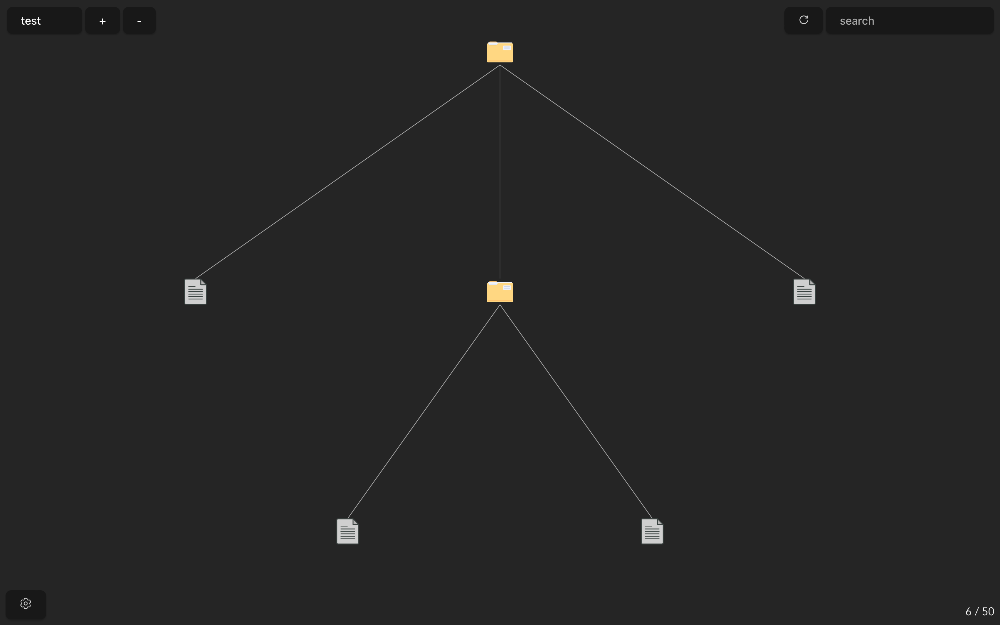
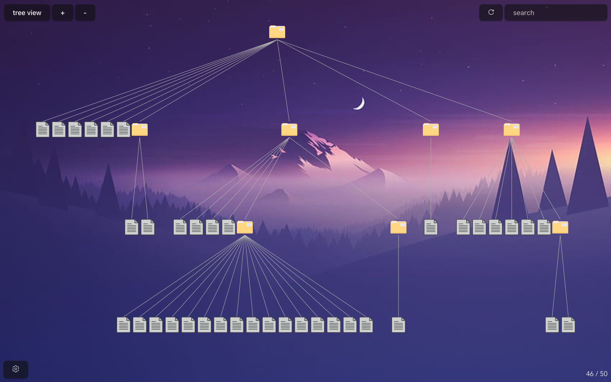

<p align="center">
    
</p>

---
Tree View is an individual oriented task management file explorer - currently in pre-alpha.

Testing on Windows 10, Windows WSL for Ubuntu and macOs Ventura  - no guarantees for Linux

be wary of Directory Man!
<p align="center">
    
</p>

customisation example:
<p align="center">
    
</p>

## Features
- ✅ Add new `master` directories and switch between them
- ✅ Search for a file in the current directory
- ✅ Show files and folders in a vertical tree diagram
- ✅ Get properties of a file 
- ✅ Open a file in its respective app 
- ✅ Option to open directory in os's file explorer 
- ✅ Option to open directory in terminal
- ✅ Remove a file or folder
- ✅ Add a new file or folder
- ✅ Rename file or folder
- ✅ Copy file or folder
- ✅ Paste file or folder
- ✅[Settings Section](#settings-section) 
- Tags for quicker searches?
- Expand search? (if item couldn't be found, option to search other master directories)
- Link a chosen directory to a chosen file (main feature of this. unavailable in regular file explorer)
- Project management table with built-in fields and user made fields. (for v1.1)

## Todos
- Link Lines: position them better
- Make certain settings directory dependent
- Add error handling for opening, deleting, etc
- Directory watcher?

---

## Installation
As of this moment, the only way to run this for yourself is by cloning the repo
run these commands in the directory:

`npm i`

`npm run tauri dev`

This project has not been tested in its build version and is not recommended until Tree View is in 1.0

## How to use

### Master Directory
- Add your master directory with the + button at the top left
- Remove (not delete) a master directory with the - button
- Load it by clicking on the selection options - top left

### File Manipulation
- Double click on the file / folder once to open it in its respective app
- Right click for more functions (open, open w/ explorer & terminal, create & delete files/folders, add & remove master directories, properties, settings)

### Tips / Hints
- Hover over files / folders to see their name
- There is a render cap of 50 items to prevent crammed UI, this can be changed in the settings section - althought not recommended. note that this does not affect the search functionality
- The number of rendered items are displayed at the bottom right. Hover over to see the total number of actual items in directory. (shows the count of items including the hidden and ignored ones)
- Shared folders can be set as master directories for team use

### Settings Section
- Background options
- Item cap option (limit for the number of items that can be rendered)
- Ability to pin master directories
- Link colour (the lines connecting items)
- Hide specific folders option (globally - doesn't render items but still searchable) [has bug]
- Ignore specific folders option (globally - doesn't load items at all)

- Icon options? (might be too much of a hassle)

---

## How it works
Using Rust (Tauri) as the backend and Javascript (Svelte and D3) as the frontend. 

Rust recursively gets the files and folders in a chosen directory, supplies it to the frontend where it is drawn into a tree diagram.

### But how does linking unrelated folders and files work?
Currently, haven't added it yet but I believe I can create my own dot file (.gitignorre, .git, .env, etc).
It'll probably be named `.treeview` or something along those lines.

Maybe just draw a line connecting them on the frontend and save it to localstorage? not sure.

---

## Resources and references
### All assets used

[SVG Images](https://www.svgrepo.com)

### All the third party libraries used

[WalkDir](https://docs.rs/walkdir/latest/walkdir/) (Rust)

[D3](https://d3js.org) (Javascript)

[Open](https://docs.rs/open/latest/open/) (Rust)

[Rand](https://docs.rs/rand/latest/rand/) (Rust)

[Fs_extra](https://docs.rs/fs_extra/latest/fs_extra/) (Rust)

### Use of WalkDir
This is crate makes the nightmare of traversing a directory recursively incredibly easy
Initally, I wanted to write it by myself but when researching, I stumbled upon [Rust Cookbook](https://rust-lang-nursery.github.io/rust-cookbook/file/dir.html)
In there under Directory Traversal, they even used this crate so I guess it's practically a staple in the Rust directory traversal scene.

```rust
let content: Vec<_> = WalkDir::new(directory)
                    .into_iter()
                    .filter_map(|f| f.ok())
                    .map(|f| f.path().to_owned())
                    .collect();
```
That's it. Done. Amazing. Using this, I had to convert the path buffer to a string which was weirdly hard but I got there in the end. I needed it to be a regular string and not a `.display()` or `.into_os_string().into_string()` mainly because I didn't want to deal with the hassle and because I needed to spend strings to the frontend.

### Use of D3
I wanna throw a washing machine at the nearest wall.
The learning curve for D3 is insane. The docs are _decently_ documented but it feels like they assume you know what each thing returns or what methods are chainable.
To be fair, this is the first time I'm using D3, and it's gonna be the major part of this project so unless I can find a smaller library or write code that can draw diagrams from scratch by myself, I should keep quite, suck it up, and just git gud

I will say, after spending a quater of a day, it gets easier to notice similarities and a sort of "system" if that makes sense.

BUT, working with svg's is another nightmare. And the fact that there is not a lot of people using svelte and d3, there's almost no examples.

```js
// I will admit, two lines of code to setup a tree diagram is really good. but it took me a surprising amount of time to write these two lines
$: root = d3.stratify().path((d) => d)(paths);
$: treeLayout = d3.tree().size([width, height - 40])(root);
```

```js
// this is to draw the lines between the different nodes
{#each root.links() as link}
    <line x1={link.source.x} y1={link.source.y + recHeight} x2={link.target.x} y2={link.target.y} stroke="#adadad"></line>
{/each}
```
### Use of Open
Perfect and simple. This crate lets you open a file in the os's default app (whatever you set that default to be) or in a specific app.

```rust
open::that(location).unwrap();
```
That's it. literally that's it. Chef's kiss.
Although, I might need to use it more - we are mostly using rust's built in Command library because we need to run commands with certain apps when opening them (i.e. terminal and file explorer - the main ones 😅)

### Use of Fs_extra
This crate adds more functionality to the fs and io stdlib. In particular, I need their copy_items function that recursively copies files/directories to another location
Not sure if I need this need this yk, technically I could use WalkDir and the standard copy function in rust but this is easier and maybe more optimised.

```rust
// contents is a vector of copy locations
// to is a string pointing to the paste locaiton
// honestly dk what options are, it's just what was in the docs
copy_items(&contents, to, &options)
```

## Known Bugs
| bug | macos | windows |
| --- | --- | --- |
| resize window sometimes doesn't resize bg image | 🤷‍♂️ | 🕸 |
| context menu position isn't right | 🕸 | 🕸 |
