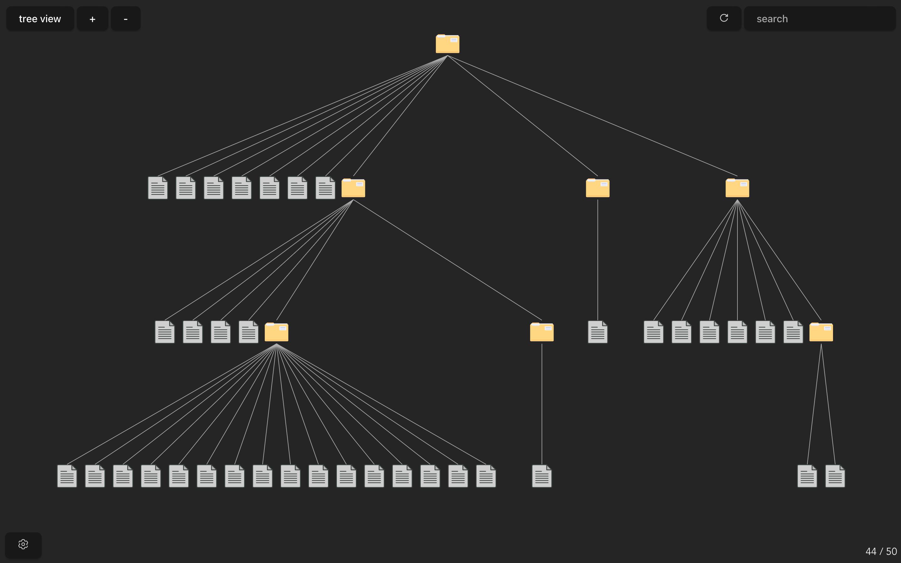

# Tree View
For Tree View to work, create a home directory (any name) where you want to house your files and folders.

be wary of Directory Man!


## Features
- ✅ Add new `master` directories and switch between them
- ✅ Search for a file in the current directory
- ✅ Show files and folders in a vertical tree diagram
- 👷‍♂️ Get properties of a file [note: the properties part is actually done but opening a file and such is still being worked on]
- Add a new file or folder
- Remove a file or folder
- Link a chosen directory to a chosen file (main feature of this. unavailable in regular file explorer)
- ✅ Open a file in its respective app 
- ✅ Option to open directory in Windows File Explorer (maybe mac later)
- 👷‍♂️ Option to open directory in terminal?

---

## How it works
Using Rust (Tauri) as the backend and Javascript (Svelte and D3) as the frontend. 

Rust recursively gets the files and folders in a chosen directory, supplies it to the frontend where it is drawn into a tree diagram.

### But how does linking unrelated folders and files work?
Currently, haven't added it yet but I believe I can create my own dot file (.gitignorre, .git, .env, etc).
It'll probably be named `.treeview` or something along those lines

---

## Resources and references
### All assets used

[SVG Images](https://www.svgrepo.com)

### All the third party libraries used

[WalkDir](https://docs.rs/walkdir/latest/walkdir/) (Rust)

[D3](https://d3js.org) (Javascript)

[Open](https://docs.rs/open/latest/open/) (Rust)

### Use of WalkDir
This is crate makes the nightmare of traversing a directory recursively incredibly easy
Initally, I wanted to write it by myself but when researching, I stumbled upon [Rust Cookbook](https://rust-lang-nursery.github.io/rust-cookbook/file/dir.html)
In there under Directory Traversal, they even used this crate so I guess it's practically a staple in the Rust directory traversal scene.

```rust
let content: Vec<_> = WalkDir::new(directory)
                    .into_iter()
                    .filter_map(|f| f.ok())
                    .map(|f| f.path().to_owned())
                    .collect();
```
That's it. Done. Amazing. Using this, I had to convert the path buffer to a string which was weirdly hard but I got there in the end. I needed it to be a regular string and not a `.display()` or `.into_os_string().into_string()` mainly because I didn't want to deal with the hassle and because I needed to spend strings to the frontend.

### Use of D3
I wanna throw a washing machine at the nearest wall
The learning curve for D3 is insane. The docs are _decently_ documented but it feels like they assume you know what each thing returns or what methods are chainable.
To be fair, this is the first time I'm using D3, and it's gonna be the major part of this project so unless I can find a smaller library or write code that can draw diagrams from scratch by myself, I should keep quite, suck it up, and just git gud
I will say, after spending a quater of a day, it gets easier to notice similarities and a sort of "system" if that makes sense.

BUT, working with svg's is another nightmare. And the fact that there is not a lot of people using svelte and d3, there's almost no examples.

```js
// I will admit, two lines of code to setup a tree diagram is really good. but it took me a surprising amount of time to write these two lines
$: root = d3.stratify().path((d) => d)(paths);
$: treeLayout = d3.tree().size([width, height - 40])(root);
```

```js
// this is to draw the lines between the different nodes
{#each root.links() as link}
    <line x1={link.source.x} y1={link.source.y + recHeight} x2={link.target.x} y2={link.target.y} stroke="#adadad"></line>
{/each}
```
### Use of Open
Perfect and simple. This crate lets you open a file in the os's default app (whatever you set that default to be) or in a specific app.

```rust
open::that(location).unwrap();
```
That's it. literally that's it. Chef's kiss.
